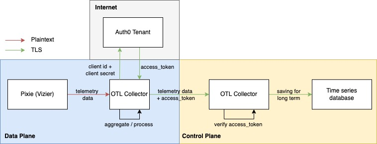

# Pixie for multi cluster observability
Proof of concept on retaining [Pixie's](https://github.com/pixie-io/pixie) observability data for long term in multi cluster setups using [OpenTelemetry Collector](https://github.com/open-telemetry/opentelemetry-collector-contrib).

# High Level Architecture 
